# SRE DevOps CheatSheet

## Table of Contents
<!-- TOC start -->
- [SRE DevOps CheatSheet](#sre-devops-cheatsheet)
  - [Table of Contents](#table-of-contents)
- [AWS Services](#aws-services)
- [Benefits of Cloud computing](#benefits-of-cloud-computing)
  - [Ease of use](#ease-of-use)
  - [Flexibility](#flexibility)
  - [Robustness](#robustness)
  - [Cost](#cost)
- [What is SRE?](#what-is-sre)
  - [SRE traits](#sre-traits)
  - [AWS Global Infrastructure](#aws-global-infrastructure)
  - [Regions VS Availability Zones](#regions-vs-availability-zones)
  - [Four pillars of cloud computing](#four-pillars-of-cloud-computing)
    - [Performance](#performance)
    - [Security](#security)
    - [Reliability](#reliability)
    - [Functionality](#functionality)
  - [What is CDN](#what-is-cdn)
  - [What is Auto-Scaling](#what-is-auto-scaling)
  - [On Prem vs Hybrid vs Public Cloud](#on-prem-vs-hybrid-vs-public-cloud)
    - [On Premises](#on-premises)
    - [Hybrid](#hybrid)
    - [Public Cloud](#public-cloud)
  - [AWS VM connection diagram](#aws-vm-connection-diagram)
  - [Simple Storage Service - S3](#simple-storage-service---s3)
    - [Installation](#installation)
    - [Commands](#commands)
  - [Creating of an EC2 Instance](#creating-of-an-ec2-instance)
    - [Linux basics](#linux-basics)
      - [File permissions](#file-permissions)
    - [Bash scripting](#bash-scripting)
  - [Tomcat](#tomcat)
    - [Bash script for tomcat](#bash-script-for-tomcat)
  - [NGINX](#nginx)
  - [Docker](#docker)
    - [Buzz-words](#buzz-words)
      - [Image](#image)
      - [Container](#container)
    - [Bash script for installation](#bash-script-for-installation)
    - [Installation on PC (local for Windows 10)](#installation-on-pc-local-for-windows-10)
    - [Repository creation](#repository-creation)
      - [Example with nginx step-by-step](#example-with-nginx-step-by-step)
  - [Technical interview questions](#technical-interview-questions)
  - [Monolith Architecture & Microservices Architecture](#monolith-architecture--microservices-architecture)
      - [Monolith Architecture](#monolith-architecture)
      - [Microservices Architecture](#microservices-architecture)
    - [2- and N-tier Architecture](#2--and-n-tier-architecture)
      - [2- tier Architecture](#2--tier-architecture)
      - [N-tier Architecture](#n-tier-architecture)
  - [Software Development Lifecycle (Environments)](#software-development-lifecycle-environments)
    - [Planning](#planning)
    - [Development](#development)
    - [Testing](#testing)
    - [Staging](#staging)
    - [Production](#production)
- [Useful links](#useful-links)
      - [~Adam Franciszek Felix Kolaczynski](#adam-franciszek-felix-kolaczynski)
<!-- TOC end -->

# AWS Services

- Creating github repo to push the markdown doc
- Amazon Web Services (AWS)

# Benefits of Cloud computing

## Ease of use
  
AWS is designed to allow application providers, ISVs, and vendors to quickly and securely host your applications – whether an existing application or a new SaaS-based application.

## Flexibility
  
AWS enables you to select the operating system, programming language, web application platform, database, and other services you need. With AWS, you receive a virtual environment that lets you load the software and services your application requires. This eases the migration process for existing applications while preserving options for building new solutions.

## Robustness
  
With AWS, you take advantage of a scalable, reliable, and secure global computing infrastructure, the virtual backbone of Amazon.com’s multi-billion dollar online business that has been honed for over a decade. Using AWS tools, Auto Scaling, and Elastic Load Balancing, your application can scale up or down based on demand. Backed by Amazon’s massive infrastructure, you have access to compute and storage resources when you need them.

## Cost
  
You pay only for the compute power, storage, and other resources you use, with no long-term contracts or up-front commitments. For more information on comparing the costs of other hosting alternatives with AWS, see the AWS Economics Center.

# What is SRE?

 SRE (Site Reliability Engineer) - Role within tech industry that is responsible for understanding every core feature of a service/product and ensuring it's availability and usability throughout it's entire lifecycle.

## SRE traits

- Studious
- Problem Solver
- Creative
- Communicative

#

## AWS Global Infrastructure

The AWS Global Cloud is the most secure,extensive and reliable cloud platform that provides you the cloud infrastructure where and when you need it with a single-digit milisecond latency.

[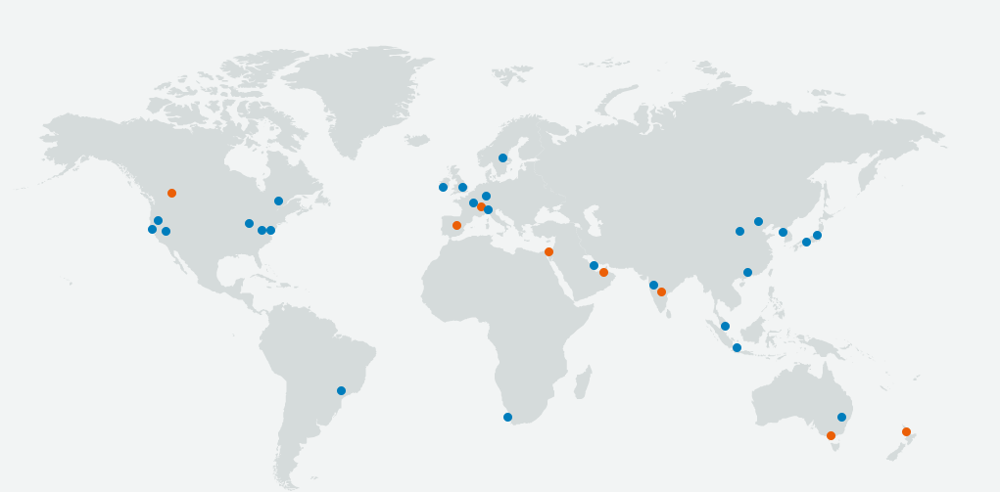](https://aws.amazon.com/about-aws/global-infrastructure/regions_az/)
- 84 Availability zones with 26 total regions


#

## Regions VS Availability Zones

AWS Region concept:

- Physical location around the world where we cluster data centers. Each group of logical data centers are called Availability Zone.

Availability zone

- One or more discrete data centers with redundant power, networking, and connectivity in an AWS Region.

#

## Four pillars of cloud computing

### Performance

- Almost unlimited scalability
- Ability to quickly add nodes/servers/offerings (hybrid/public/private)

### Security

- Both physical and virtual security
- Protection against virtual threats i.e. DDoS, Leaks etc.
- Protection against physical threats i.e. destruction of servers, natural disasters, unauthorised access to the premises etc.

### Reliability

- Every possible scenario has been taken in consideration and prepared for.
- High availability(If you can't access it when you need it most it's not highly available)

### Functionality

- Modern use cases usually require the application of multiple analytic functions working together on the same data.
  
#
## What is CDN

Content Delivery Network refers to a geographically distributed group of servers that work together to provide fast delivery of Internet content.
#

## What is Auto-Scaling

Scaling (the server) with accordance to the demand.

#
## On Prem vs Hybrid vs Public Cloud


### On Premises
- &nbsp;+ Highest level of security
- &nbsp;+ Best for storing sensitive data
- &nbsp;- &nbsp;Not cost Effective

### Hybrid
- &nbsp; +/- Medium cost efficiency
- &nbsp; + Best medium for storing sensitive data while providing cost effective service

### Public Cloud
- &nbsp; + Most cost effective
- &nbsp; - Sensitive data may be endangered
- &nbsp; + Worldwide coverage
  
#
## AWS VM connection diagram
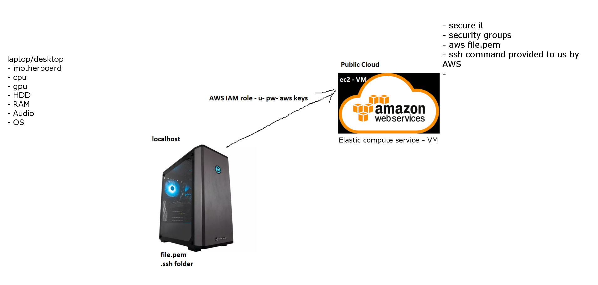

Funny paint/gimp diagram but displays connection of a PC(localhost) to AWS via AWS IAM.

- file.pem - PEM stands for Privacy Enhanced Mail. The PEM format is often used to represent certificates, certificate requests, certificate chains, and keys. 
- .ssh folder - folder that contains .ssh files
    - SSH, also known as Secure Shell or Secure Socket Shell, is a network protocol that gives users, particularly system administrators, a secure way to access a computer over an unsecured network.
      - SSH uses port 22 [IMPORTANT]

- As long as the connection is exactly specified it is secure
- AWS IAM (Identity and Access Management) role is an IAM entity that defines a set of permissions for making AWS service requests. IAM roles are not associated with a specific user or group. Instead, trusted entities assume roles, such as IAM users, applications, or AWS services such as EC2.
- EC2 - Elastic Cloud Compute - provides scalable computing capacity in the AWS cloud. Leveraging it enables organizations to develop and deploy applications faster, without needing to invest in hardware upfront. Users can launch virtual servers, configure security and networking, and manage cookies from an intuitive dashboard.

## Simple Storage Service - S3


- Amazon Simple Storage Service (Amazon S3) is an object storage service that offers industry-leading scalability, data availability, security, and performance.
- Customers of all sizes and industries can use Amazon S3 to store and protect any amount of data for a range of use cases, such as data lakes, websites, mobile applications, backup and restore, archive, enterprise applications, IoT devices, and big data analytics.
- Amazon S3 provides management features so that you can optimize, organize, and configure access to your data to meet your specific business, organizational, and compliance requirements.
  
&nbsp;

- Data Back up - Disaster recovery plan (DR)
- S3 classes
- S3 is globally available - HIGHLY AVAILABLE

### Installation

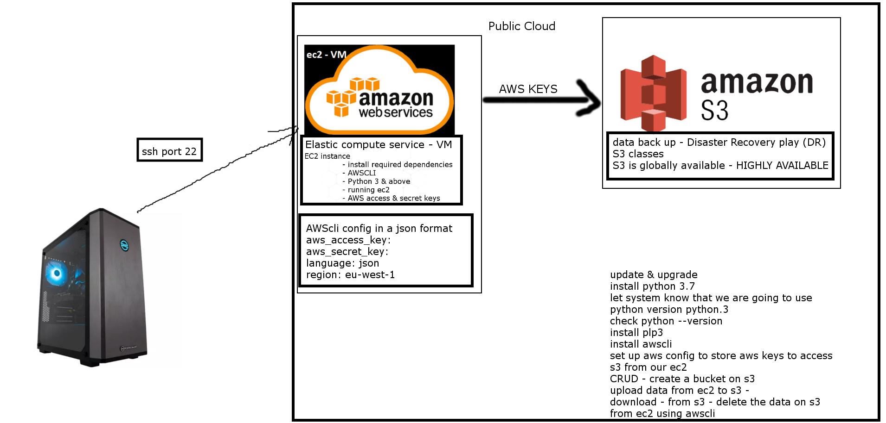

### Commands

- https://docs.aws.amazon.com/cli/latest/userguide/cli-services-s3-commands.html

&nbsp;

- `aws configure`
- input id keys, region id and format
- `aws s3 ls` using aws go to s3 service and list all buckets
- `aws s3 ls s3://{bucketName}` list all files inside this bucket
- `aws s3 mb s3://{bucketName}` create a new bucket
- `aws s3 cp s3://{bucketName}/{file} {newPath}` copy file from s3 into the new path
  
#
## Creating of an EC2 Instance

- Login and access to AWS services
- Choose AMI (ubuntu 18.0.4)
- Choose EC2 Instance Types (default bc cheap lol)
- Configure Instance Details
  - Subnet choose "default a"
- Add storage
- Tag instance (for me it's 105_sre_adam_{purpose})
- Configure security groups
  - SSH on My Ip (port 22)
  - HTTP on anywhere (port 80)
  - HTTPS ONLY if you have ssl certificate
- Review instances
  - Select key name
- Launch :D
  
#

In a terminal window (preferably gitbash) follow steps from AWS:

The link should look like this: 

` ssh -i /path/my-key-pair.pem my-instance-user-name@my-instance-public-dns-name `

Once connected update all the required services via `sudo apt-get update -y` and `sudo apt-get upgrade -y` commands. Then install via `sudo apt-get install {name} -y`

Example: after installing nginx with a `sudo apt-get install nginx -y` command your output from the [website](http://34.244.154.49/) should look like this:

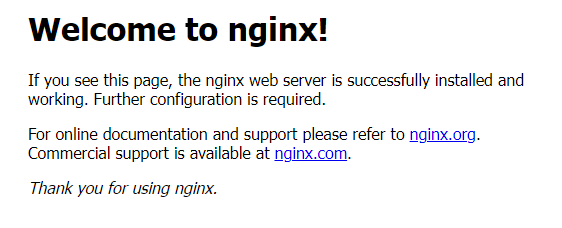

#
### Linux basics

- add `sudo` before any command to use it with admin privelages
- start the service with `sudo systemctl start {service}`
- stop the service with `sudo systemctl stop {service}`
- to check the status use `systemctl status {service}`
- to enable the service use `sudo systemctl enable {service}`
- to install the service use `sudo apt-get install {package_name}`. To automate the command add `-y` parameter at the end of the command
- to uninstall the service use `sudo apt remove {package_name}`
- use `top` to show details of all active processes
- information of the system `uname` or `uname -a` (whoami)
- `pwd` print working directory (whereami)
- `mkdir {dir_name}` make directory(folder)
- `ls` to list all folders, with parameter `-a` lists all hidden folders
- how to create a file `touch name_file` or `nano file_name` (if you want to edit it straight after creating) or `cat > file_name` (if you want to edit it straight after within the commandline as a stream)
- to check contents of the file use `cat file_name`
- `mv file "new path for the file"` to move the file
  - make sure to provide quotations otherwise `mv file new_file_name` will change the name
- to delete a file (BE SURE ABOUT IT!) use `rm filename`

For the linux cheat sheet go [here](https://www.guru99.com/linux-commands-cheat-sheet.html)

#### File permissions
- to check file permission type `ls -l`
- to edit file permission type `sudo chmod {rwx} filename` for example if you want readonly you use `sudo chmod r-- filename`
- rwx is described in binary form i.e. `sudo chmod 700` will create permission type of -rwx------
  - 0 = ---
  - 1 = --x
  - 2 = -w-
  - 3 = -wx
  - 4 = r--
  - 5 = r-x
  - 6 = rw-
  - 7 = rwx
- to check the file permissions `ll`
- [another cheat sheet](https://chmod-calculator.com/)

### Bash scripting

- code block
  ```bash
  # create a file called provision.sh
  #!/bin/bash
  # run updates
  sudo apt-get update -y
  # run upgrades
  sudo apt-get upgrade -y
  # install nginx
  sudo apt install nginx -y
  # ensure it's running - start nginx
  sudo systemctl start nginx
  # enable nginx
  sudo systemctl enable nginx

  ```

  - change the file to exe `chmod +x provision.sh`
  - how to run an exe file `./provision.sh`
  - 

## Tomcat

### Bash script for tomcat

```bash
#!/bin/bash
  # install tomcat
  sudo apt install tomcat9 -y
  # ensure it's running - start tomcat
  sudo systemctl start tomcat9
  # enable tomcat
  sudo systemctl enable tomcat9
  # allow traffic to port 8080
  sudo ufw allow from any to any port 8080 proto tcp
```
Apache Tomcat (called "Tomcat" for short) is a free and open-source implementation of the Jakarta Servlet, Jakarta Expression Language, and WebSocket technologies. Tomcat provides a "pure Java" HTTP web server environment in which Java code can run.

Remember that: 
- Tomcat runs on port 8080 so enable inbound for this port
- Tomcat may interfere with other web container services so be wary which services you want to run on which ports

Use cases for tomcat:
- Static page hosting
- Reverse proxy
- Dynamic web applications via Java Servlets and JSP
- Running WebSocket applications
- Load balancers

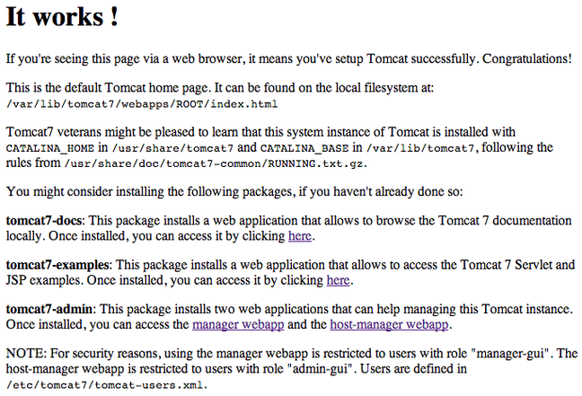

`default page of tomcat on port`

## NGINX 
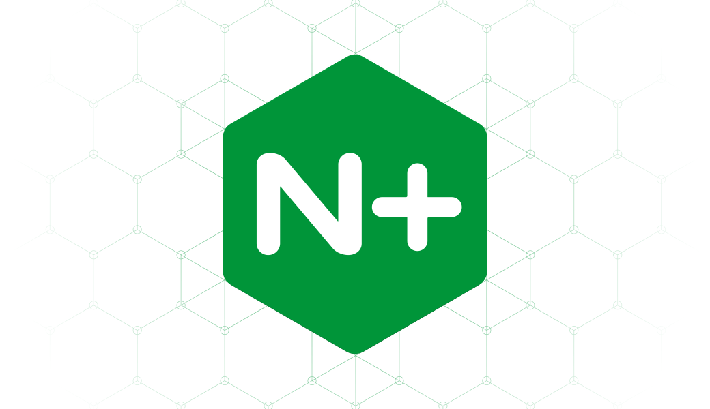

NGINX is open source software for web serving, reverse proxying, caching, load balancing, media streaming, and more. It started out as a web server designed for maximum performance and stability. In addition to its HTTP server capabilities, NGINX can also function as a proxy server for email (IMAP, POP3, and SMTP) and a reverse proxy and load balancer for HTTP, TCP, and UDP servers.

## Docker

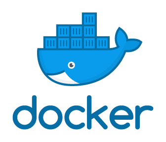

`Docker is an application build and deployment tool. It is based on the idea of that you can package your code with dependencies into a deployable unit called a container.`

- Docker can package an application and its dependencies in a virtual container that can run on any Linux, Windows, or macOS computer.
- This enables the application to run in a variety of locations, such as on-premises, in public or private cloud.
- When running on Linux, Docker uses the resource isolation features of the Linux kernel and a union-capable file system to allow containers to run within a single Linux instance, avoiding the overhead of starting and maintaining virtual machines.
- Docker on macOS uses a Linux virtual machine to run the containers.

### Buzz-words

#### Image

- A Docker image is a read-only template that contains a set of instructions for creating a container that can run on the Docker platform.
- It provides a convenient way to package up applications and preconfigured server environments, which you can use for your own private use or share publicly with other Docker users.

#### Container

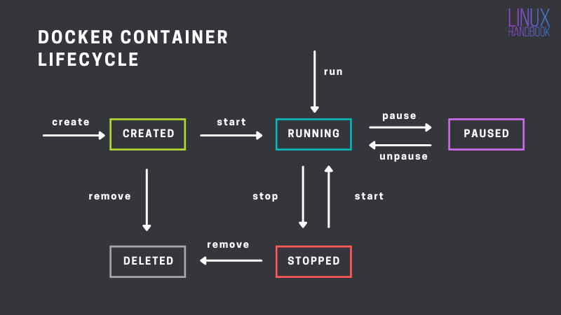

- A container is a standard unit of software that packages up code and all its dependencies so the application runs quickly and reliably from one computing environment to another.
- A Docker container image is a lightweight, standalone, executable package of software that includes everything needed to run an application: code, runtime, system tools, system libraries and settings.

### Bash script for installation

```bash
#!/bin/bash
  # uninstall old ver of docker(s)
  sudo apt-get remove docker docker-engine docker.io containerd runc
  # update repos
   sudo apt-get update
 sudo apt-get install \
    ca-certificates \
    curl \
    gnupg \
    lsb-release
  # Add Docker's official GPG key
   curl -fsSL https://download.docker.com/linux/ubuntu/gpg | sudo gpg --dearmor -o /usr/share/keyrings/docker-archive-keyring.gpg
    echo \
  "deb [arch=$(dpkg --print-architecture) signed-by=/usr/share/keyrings/docker-archive-keyring.gpg] https://download.docker.com/linux/ubuntu \
  $(lsb_release -cs) stable" | sudo tee /etc/apt/sources.list.d/docker.list > /dev/null
  sudo apt install t -y
  # ensure it's running - start docker
   sudo apt-get update
 sudo apt-get install docker-ce docker-ce-cli containerd.io
  sudo systemctl start docker-ce docker-ce-cli containerd.io
  # enable docker
  sudo systemctl enable docker-ce docker-ce-cli containerd.io
  sudo apt-get update
  sudo docker run hello-world
```

### Installation on PC (local for Windows 10)

- Follow steps from this [link](https://hub.docker.com/editions/community/docker-ce-desktop-windows)
- Make sure that your hardware has virtualization enabled in BIOS (CPU)
- Log in
- That's it !
  
### Repository creation

- First you create a rep on DockerHub ( <b> name convention is lowercase </b>)
- Once you've finished working on the container you commit it as an image with command: `docker commit {ID OF CONTAINER} {FULL REPO NAME}`
- Once you've created the image you want to push to repo use commad: `docker push {FULL REPO NAME}:{TAG}` ( <b> if no tag is written it'll be pushed to `latest` </b>)
- That's pretty much it !
  
#### Example with nginx step-by-step

- Pull and run nginx with `docker run -d -p 80:80 nginx`
  - It pulls nginx and runs it
  - `-d` specifies detached (logs are not displayed live on the docker cmd)
  - `-p` specifies ports first `80` specifies localhost port, second `80` specifies default port of the container (default 80 for nginx)
  - Ports specification is fairly similar to how nginxs proxy works
- Get nginx container ID with `ps` command
- Enter nginx container AMI with `docker exec -it {CONTAINER ID} sh`
  - TIP: <b> To understand in what environment you're in use `uname -a` </b>
- In this part you edit the nginx html you can do it either by:
  - Installing nano and editing /usr/share/nginx/html/index.html
  - Creating index.html on your local machine and uploading it with command: `docker cp {path to the file on local machine}/index.html {CONTAINER ID}:/usr/share/nginx/html/index.html`
- Now that container part is done we commit the container into an image with `docker commit {ID OF CONTAINER} {FULL REPO NAME}`
- And now we push it to our repo with `docker push {FULL REPO NAME}:{TAG}`
- <h1> That's it ! </h1>

## Technical interview questions

What is a VPC

- A virtual private cloud (VPC) is a secure, isolated private cloud hosted within a public cloud. VPC customers can run code, store data, host websites, and do anything else they could do in an ordinary private cloud, but the private cloud is hosted remotely by a public cloud provider.

What is Internet gateway

- An Internet gateway is a network "node" that connects two different networks that use different protocols (rules) for communicating.
- In the most basic terms, an Internet gateway is where data stops on its way to or from other networks.
- Thanks to gateways, we can communicate and send data back and forth with each other.

What is route tables

- In computer networking, a routing table, or routing information base (RIB), is a data table stored in a router or a network host that lists the routes to particular network destinations, and in some cases, metrics (distances) associated with those routes.
- The routing table contains information about the topology of the network immediately around it.

What is a subnet

- A subnet, or subnetwork, is a network inside a network. Subnets make networks more efficient.
- Through subnetting, network traffic can travel a shorter distance without passing through unnecessary routers to reach its destination.

What is NACLS

- NACL refers to Network Access Control List, which helps provide a layer of security to the Amazon Web Services stack.
- NACL helps in providing a firewall thereby helping secure the VPCs and subnets.
- It helps provide a security layer which controls and efficiently manages the traffic that moves around in the subnets.
  
===================================================

- Security group is the firewall of EC2 Instances.
- Network ACL is the firewall of the VPC Subnets.

===================================================

What is Security group

- A security group acts as a virtual firewall, controlling the traffic that is allowed to reach and leave the resources that it is associated with.
- For example, after you associate a security group with an EC2 instance, it controls the inbound and outbound traffic for the instance.

How did you secure your ap on the public cloud?

- Running tests on the app to determine limits of the public cloud
- Setting up Security Group / Server Firewall
- Installing/buying services that protect the instance against attacks designed to slow down/terminate the service

What are the outbound rules for SG by default? And why?

- Default SG starts with only one outbound rule that allows all traffic to leave the resource.
- You must add rules to enable any inbound traffic or to restrict the outbound traffic.
- A security group can be used only in the VPC for which it is created.

What is the command to kill a process in linux?

- `kill` command is used to send a signal to processes. The most frequently used one is `SIGKILL` or `-9` which terminates the given process
- Syntax `kill [OPTIONS] [PID]`
  - `[OPTIONS]` - type of signal
  - `[PID]` - Process ID number
  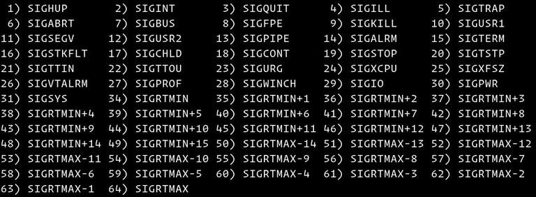
- Most common way of using kill command is that instead of looking for specific PID we use `pidof {processname}` to find it i.e. to kill firefox process we'd use `kill -9 $(pidof firefox)`
- Sidenote: if you want to find PID yourself use `ps a` command. It'll display all running processes

#

## Monolith Architecture & Microservices Architecture

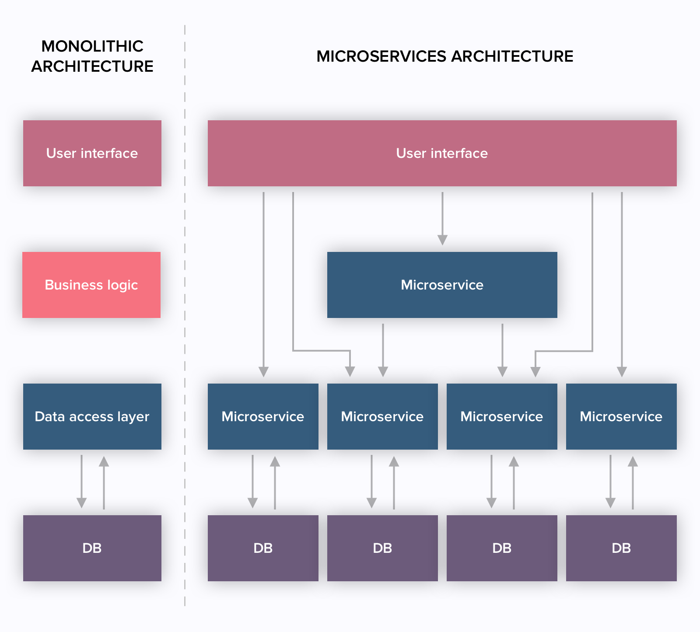
#### Monolith Architecture


- One big service
- Simple but has limitations and complexity
- Heavy apps can slow down the startup tim
- Each update results into redeploying the full stack app
- Challenging to scale up
- Perfect for small services that don't require scaling

#### Microservices Architecture

- Multiple small services
- User doesn't have direct access to any database
- Easily scalable (out and up)
- Adding features/services requires less refactoring
- Difficult to manage
- Expensive
- Most Secure
  
### 2- and N-tier Architecture

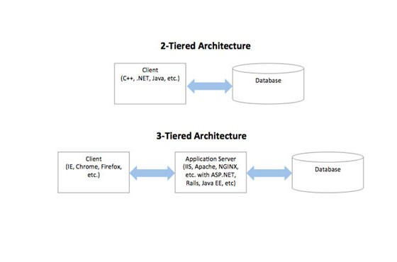

#### 2- tier Architecture

- A two-tier architecture is a software architecture in which a presentation layer or interface runs on a client, and a data layer or data structure gets stored on a server.
- Separating these two components into different locations represents a two-tier architecture, as opposed to a single-tier architecture.

#### N-tier Architecture

- An N-tier architecture divides an application into logical layers and physical tiers.
- Layers are a way to separate responsibilities and manage dependencies.
- Each layer has a specific responsibility.
- A higher layer can use services in a lower layer, but not the other way around.

## Software Development Lifecycle (Environments)

### Planning

- Turning idea into a plan on how to create the product
  
### Development

- Environment in which you implement the steps made within Planning environment
  
### Testing

- MOST important step
- Nothing goes into production before it goes through testing

### Staging

- A safe space right before production
- Product is fully finished and ready for production but hasn't been pushed yet
- Final chance to make any changes

### Production

- Product is finished and pushed to public
  
#

# Useful links

- https://www.comparethecloud.net/articles/the-four-pillars-of-an-enterprise-data-cloud/
- https://aws.amazon.com/application-hosting/benefits/
- https://www.instec-corp.com/instec-insights-the-four-pillars-of-cloud-computing
- https://www.guru99.com/creating-amazon-ec2-instance.html#3
- https://docs.aws.amazon.com/cli/latest/userguide/cli-services-s3-commands.html

#
#### ~Adam Franciszek Felix Kolaczynski